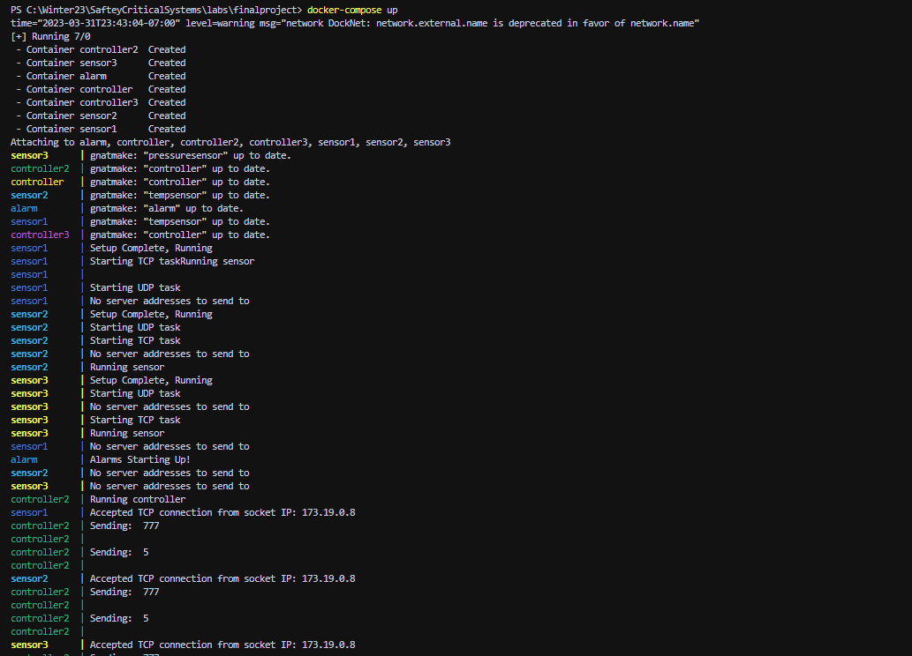

# FinalProject

## 1. Run the docker network command first
docker network create -d bridge DockNet --subnet=173.19.0.0/16

## 2. Run the docker container command second
docker-compose up 

## 3. Read the output from the Text File
 A file in will be created in the bild directory called Alam.txt this is where you will see the UI.

### FinalProject test run results

## 4. To stop the docker container
(CTRL + C) to stop the docker container

# Description of the project

The project connects sensors with a controller which relays information to an alarm. 

The processes run on separate containers in a docker network and connect and communicate over TCP and UDP connections using sockets.

# Need help with the network connection between the containers?
https://docs.docker.com/config/containers/container-networking/

## to view the network
docker network ls

docker network inspect DockNet
